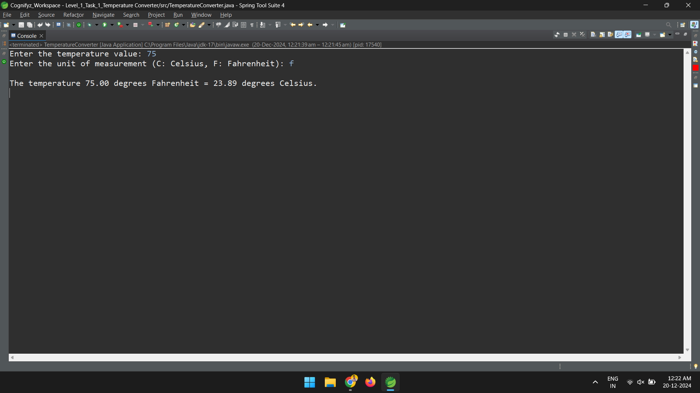
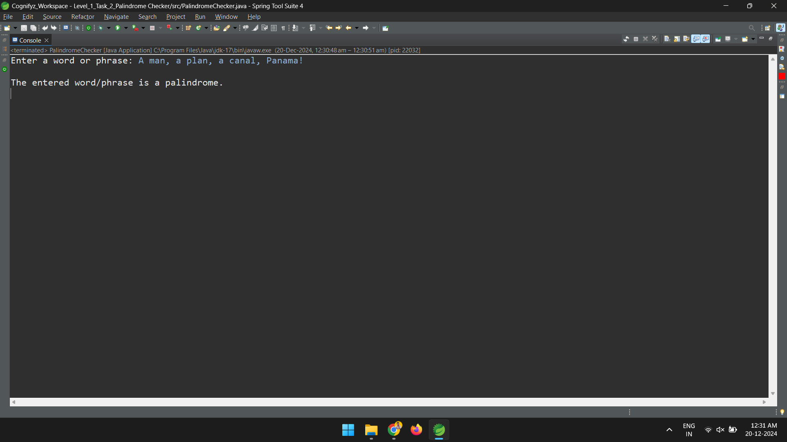
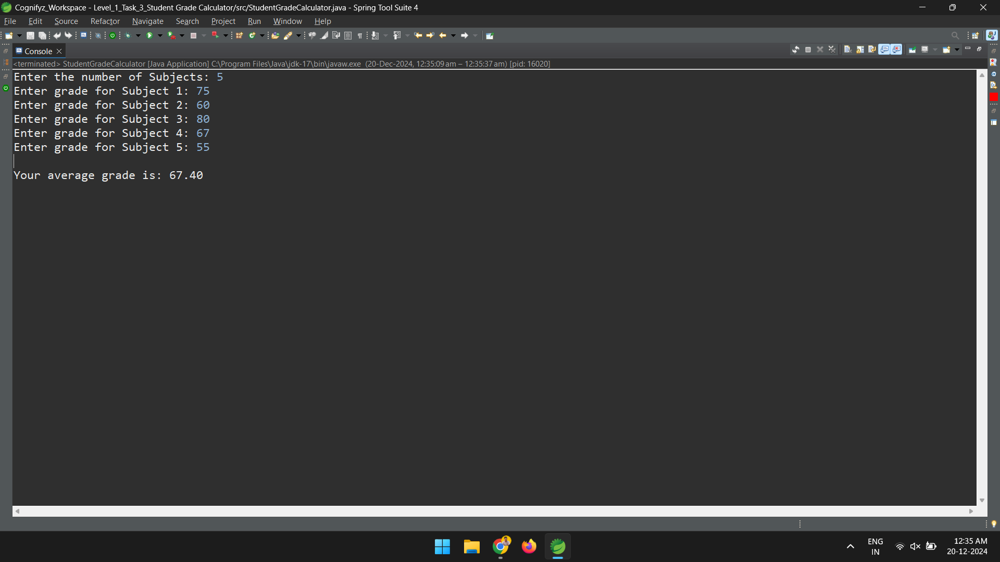
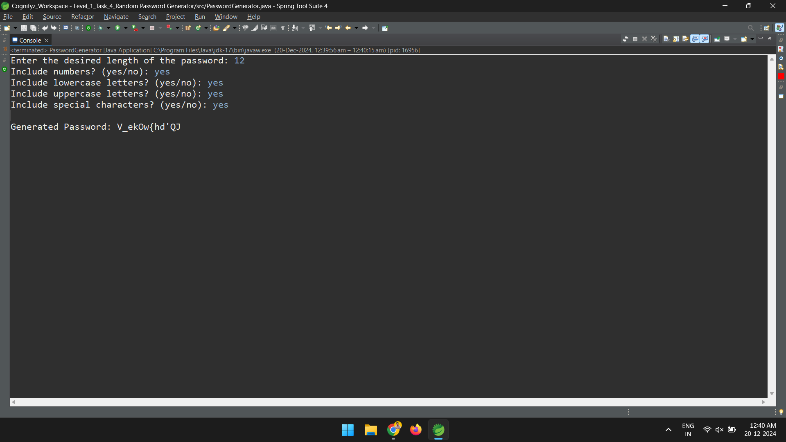
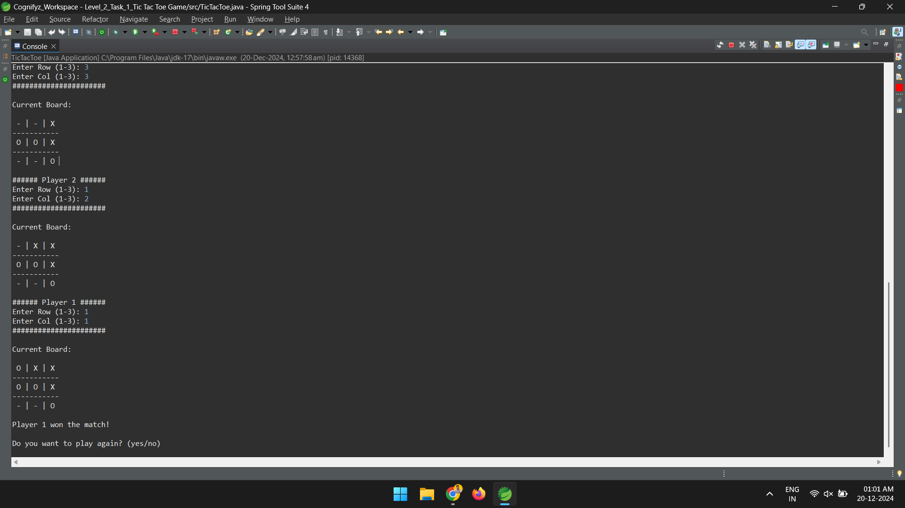
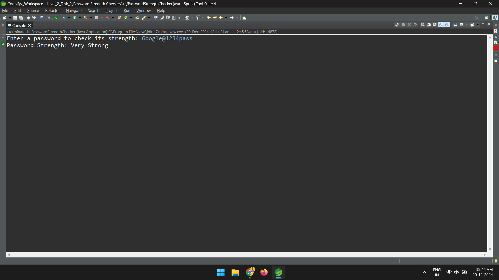
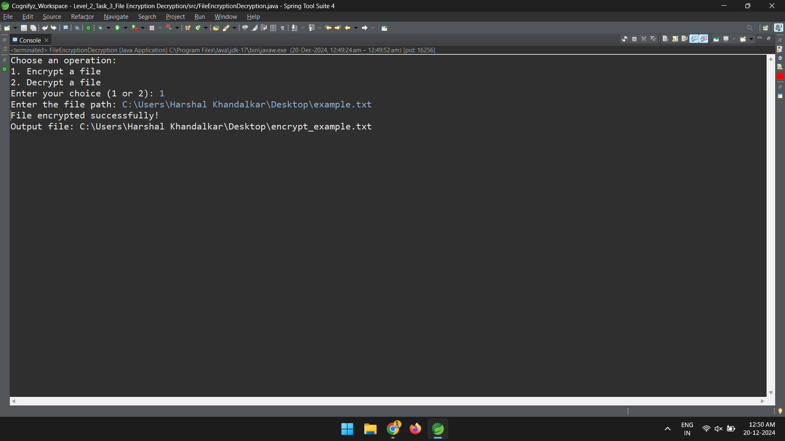
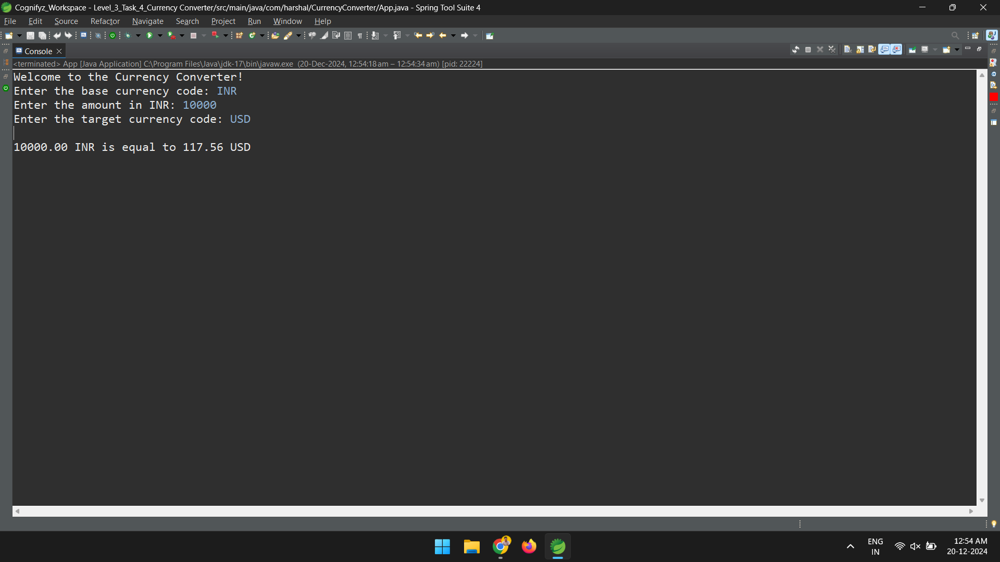

# Cognifyz Technologies Internship - Java Development

This repository contains the tasks completed during my Java Development internship at **Cognifyz Technologies**, where I developed practical solutions for various programming challenges.

## Internship Overview

As part of this internship, I completed **8 tasks** from different levels of complexity designed to enhance programming skills in Java. The tasks covered diverse areas such as file handling, string manipulation, API integration.

## Task List

Below are the tasks I worked on:

### Level 1

**1. Temperature Converter**

- Converts temperatures between Celsius and Fahrenheit based on user input.

- **Output**:
  

**2. Palindrome Checker**

- Checks if a word or phrase is a palindrome, ignoring spaces and punctuation.

- **Output**:
  

**3. Student Grade Calculator**

- Calculates the average grade for a student based on user input.

- **Output**:
  

**4. Random Password Generator**

- Generates a random password with specified criteria (length, character types).

- **Output**:
  

### Level 2

**5. Tic-Tac-Toe Game**

- A two-player game that checks for win/draw conditions after each move.

- **Output**:
  

**6. Password Strength Checker**

- Analyzes a password's strength based on various criteria (length, character types).

- **Output**:
  

**7. File Encryption/Decryption**

- Encrypts or decrypts text file contents based on user selection.

- **Output**:
  

### Level 3

**8. Currency Converter**

- Converts currency using real-time exchange rates retrieved from an API.

- **Output**:
  
